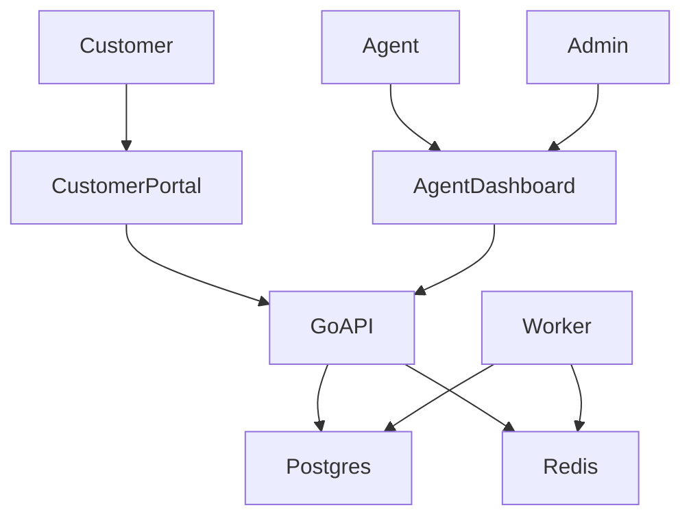
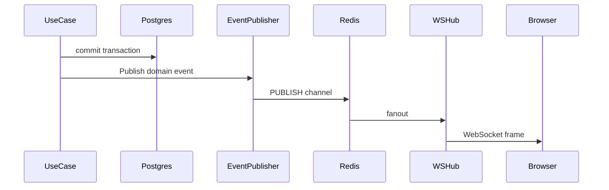

# Customer Support & SLA Desk

Fullstack support platform: customers create and track tickets; agents manage assignment, SLA timers, internal notes, attachments, and realtime updates.

**Stack:** Go API (DDD modular monolith + sqlc queries) · PostgreSQL · Redis · React (Vite + TanStack Query + Zustand)

## Quick start

```bash
# 1. Dependencies
docker compose up -d postgres redis

# 2. API (+ auto-migrate + bootstrap admin/agent)
make run-api

# 3. Worker (SLA breach + escalation queue)
make run-worker

# 4. Optional demo seed (team, tags, canned reply, sample customer ticket)
make seed

# 5. Frontend
cd web && npm install && npm run dev
```

| Service | URL |
|---------|-----|
| API health | http://localhost:8080/health |
| API | http://localhost:8080/api/v1 |
| Web | http://localhost:5173 |

### Dev accounts

| Role | Email | Password |
|------|-------|----------|
| Admin | `admin@example.com` | `admin-password-change-me` |
| Agent | `agent@example.com` | `agent-password-change-me` |

Change these (and `jwt.secret`) before any non-local deploy. Customers self-register at `/register`.

Full demo stack (API in Docker): `docker compose --profile app up --build`.

## Role diagram



- **Customer:** own tickets, public replies, attachments
- **Agent:** queue, assign, escalate, internal notes, canned replies, tags, saved filters
- **Admin:** agent capabilities + team management

## SLA logic

| Priority | Target (wall clock) |
|----------|---------------------|
| low | 72h |
| medium | 24h |
| high | 8h |
| urgent | 2h |

- Set on create and priority change (including escalate).
- Status `pending` **pauses** SLA (`sla_paused_at` + remaining seconds); leaving `pending` resumes.
- Worker marks `breached_at` when due and not paused / not resolved|closed, then audits + publishes `sla.breached`.

Allowed status transitions: `open ↔ pending`, `open|pending → resolved`, `resolved → open|closed`.

## Realtime update flow



Browser connects to `GET /api/v1/ws?token=<access_jwt>` (Bearer also accepted). Events include `ticket.created`, `ticket.updated`, `comment.created`, `ticket.escalated`, `sla.breached`.

## Layout

```
cmd/{api,worker,migrate,seed}
internal/domain          # entities, ports
internal/usecase         # application services
internal/adapter         # HTTP, WS, postgres, storage
internal/infrastructure  # config, DB, Redis
web/                     # React SPA
docs/                    # phase implementation guides
migrations/app/          # SQL migrations
db/queries/              # sqlc sources
```

See [docs/README.md](docs/README.md) for phase checklists.

## Tests

```bash
make test                 # Go unit tests (entity + password + lifecycle)
cd web && npm run build   # Typecheck + production build
cd web && npm run test:e2e  # Playwright smoke (API + web must be running)
```

Set `E2E_API_URL` / `E2E_WEB_URL` if not using defaults (`http://localhost:8080`, `http://localhost:5173`).

## Core API

- Auth: `/auth/register|login|refresh|logout`, `/me`
- Tickets: CRUD-ish list/get/patch, comments, attachments, timeline, escalate, tags
- Ops: agents, teams, canned replies, tags, saved filters
- Internal: `POST /internal/email-to-ticket` with `X-Internal-Token`
- Realtime: `/ws`
