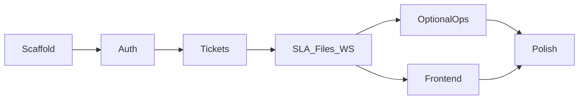

# Customer Support & SLA Desk — Implementation Plan

**Architecture style:** DDD / Clean Architecture modular monolith — domain, use cases, adapters, infrastructure — Go API + worker, single PostgreSQL database, Redis for realtime/queues/rate limits, React SPA.

**Scope:** Full product brief — Core MVP checklist **and** all Optional features: email-to-ticket mock, canned replies, tagging and saved filters, SLA breach worker, escalation notification queue, full-text search, audit log / status history timeline, rate limits.

**Persistence:** Hand-written SQL migrations + **sqlc** (not sqlx). Package layout and DDD practices match [digital-wallet-go](https://github.com/XoDeR/digital-wallet-go).

**Documentation rule:** Write and update project docs **in the same phase as the feature**. Each phase has a dedicated checklist under `docs/phase-*.md`. Final phase is polish and cross-linking only.

---

## Locked decisions

| Concern | Choice |
|---------|--------|
| HTTP | Gin + go-playground validator |
| DB | PostgreSQL + sqlc + `pgx/v5` (database/sql bridge) |
| Cache / queues / WS scale | Redis |
| IDs | UUID v7 |
| Passwords | Argon2id |
| Auth | JWT access + hashed refresh tokens with rotation |
| Roles | `customer` \| `agent` \| `admin` |
| Jobs | `robfig/cron` in `cmd/worker` |
| Attachments | Local FS for demo; storage port + R2/S3 stub |
| Frontend | Vite, React, TypeScript, Tailwind, shadcn/ui, TanStack Query, Zustand |
| Config | YAML + env overrides |
| Logging | `slog` wrapper |
| Tests | Go integration + Playwright (and Jest where useful) |

---

## Domain model

### Enums

| Concept | Values / rules |
|---------|----------------|
| Status | `open`, `pending`, `resolved`, `closed` — see state machine below |
| Priority | `low`, `medium`, `high`, `urgent` |
| Category | `billing`, `technical`, `account`, `other` |
| Comment visibility | `public`, `internal` |

**Status transitions** (enforced on `Ticket.TransitionTo`):

```text
open     ↔ pending
open     → resolved
pending  → resolved
resolved → open        (reopen)
resolved → closed
closed   → (terminal; admin may force-reopen later if needed)
```

Invalid jumps (e.g. `open` → `closed`) are rejected.

**SLA (wall clock):**

| Priority | Target |
|----------|--------|
| low | 72h |
| medium | 24h |
| high | 8h |
| urgent | 2h |

Stored in `sla_policies`. `tickets.sla_due_at` set on create and priority change. While status is `pending`, SLA is **paused** (`sla_paused_at` + remaining duration).

**Escalation:** raise priority one step (cap `urgent`), write audit row, enqueue Redis escalation job (worker notifies via log + WS).

### Core entities

- `User` — email, argon2id hash, role, status
- `RefreshToken` — hashed token, expires_at, revoked_at, replaced_by
- `Team` / `TeamMember`
- `Ticket` — customer, assignee, team, status, priority, category, SLA fields, tags
- `Comment` — public/internal; soft-delete only; immutable body
- `Attachment` — storage_key, size, mime, ticket_id
- `TicketStatusHistory` / `AuditEvent`
- `CannedReply`, `SavedFilter`
- `SlaPolicy`

### Invariants

1. Customers only see/act on their own tickets (except agents/admins).
2. Internal comments never returned on customer-facing APIs.
3. Status changes go through the state machine; every change appends history.
4. Comments are append-only (soft-delete allowed).
5. WebSocket/domain events publish only after successful commit.
6. Attachment size/type limits enforced before storage write.

---

## RBAC matrix

| Action | Customer | Agent | Admin |
|--------|----------|-------|-------|
| Register (customer) | yes | — | — |
| Login / refresh | yes | yes | yes |
| Create ticket / public reply / attach | yes (own) | yes | yes |
| List own tickets | yes | — | — |
| Agent queue / assign / internal notes / escalate | — | yes | yes |
| Manage teams / agents / SLA policies | — | — | yes |
| Canned replies / saved filters | — | yes | yes |
| Email-to-ticket mock (shared secret) | — | — | internal |

---

## API surface (`/api/v1`)

**Auth:** `POST /auth/register`, `/auth/login`, `/auth/refresh`, `/auth/logout`  
**Me:** `GET /me`  
**Tickets:** `POST/GET /tickets`, `GET/PATCH /tickets/:id`, `POST .../comments`, `.../assign`, `.../escalate`, `.../attachments`, `GET .../timeline`  
**Agent/admin:** agents, teams, canned replies, saved filters, SLA policies  
**Internal:** `POST /internal/email-to-ticket`  
**Realtime:** `GET /ws`  
**Health:** `GET /health`

Envelope: `{ success, message, data, error, timestamp }`.

---

## Implementation phases

| # | Phase | Doc |
|---|-------|-----|
| 0 | Scaffold | [phase-00-scaffold.md](./phase-00-scaffold.md) |
| 1 | Auth & RBAC | [phase-01-auth.md](./phase-01-auth.md) |
| 2 | Tickets, comments, assignment | [phase-02-tickets.md](./phase-02-tickets.md) |
| 3 | SLA, attachments, realtime | [phase-03-sla-attachments-realtime.md](./phase-03-sla-attachments-realtime.md) |
| 4 | Optional ops features | [phase-04-optional-ops.md](./phase-04-optional-ops.md) |
| 5 | Frontend portals | [phase-05-frontend.md](./phase-05-frontend.md) |
| 6 | Polish & delivery | [phase-06-polish.md](./phase-06-polish.md) |



---

## Explicit non-goals

- Microservices / per-context databases
- Real ESP email ingestion (mock HTTP only)
- Production R2 billing integration (interface + local adapter first)
- Business-hours SLA calendars
- Mobile native apps
