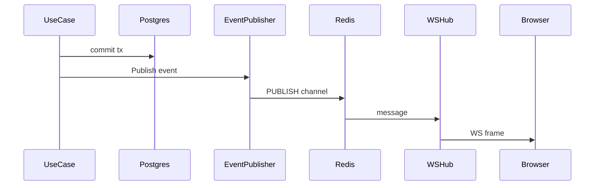

# Phase 3 — SLA, Attachments & Realtime

**Goal:** Priority-based SLA due times (with pause on `pending`); file attachments with limits and download URLs; WebSocket updates fanout via Redis after DB commit.

**Depends on:** Phase 2  
**Exit criteria:** Creating a ticket sets `sla_due_at`; pending pauses and resume adjusts due time; upload/download attachment works locally; two API instances (or pub/sub test) deliver `ticket.updated` / `comment.created` to subscribed clients after commit only.

---

## SLA

### Data

- `sla_policies` — priority → duration (seed: low 72h, medium 24h, high 8h, urgent 2h)
- Ticket columns: `sla_due_at`, `sla_paused_at` (nullable), `sla_remaining_ns` or equivalent, `breached_at` (nullable; set in phase 4 worker, column can exist now)

### Domain rules

| Event | SLA behavior |
|-------|----------------|
| Create ticket | `sla_due_at = now + policy(priority)` |
| Priority change / escalate | Recalculate remaining from policy (document chosen rule: reset from now using new priority) |
| Enter `pending` | Pause: store remaining = `sla_due_at - now`, set `sla_paused_at` |
| Leave `pending` | Resume: `sla_due_at = now + remaining`, clear pause fields |
| Already breached | Do not clear `breached_at` on pause/resume |

Expose remaining time in API/DTO for UI countdown (`sla_due_at`, `sla_paused`).

### Use case touchpoints

Hook SLA helpers into create, status change, assign/escalate (escalate may land phase 4 but priority change should update SLA here).

Admin: optional `PUT /api/v1/admin/sla-policies` (minimal).

---

## Attachments

### Storage port

```go
type ObjectStorage interface {
    Put(ctx context.Context, key string, r io.Reader, size int64, contentType string) error
    Get(ctx context.Context, key string) (io.ReadCloser, error)
    // optional: SignedURL for R2 later
}
```

- `LocalStorage` under configurable directory (docker volume)
- Stub `R2Storage` or S3-compatible interface left unimplemented/TODO

### Limits (defaults)

| Rule | Default |
|------|---------|
| Max size | 10 MiB |
| Max files per ticket | 10 |
| Allowed MIME | pdf, png, jpeg, gif, txt, webp |

Validate before `Put`. Store metadata row in `attachments`.

### HTTP

| Method | Path | Notes |
|--------|------|-------|
| POST | `/api/v1/tickets/:id/attachments` | multipart |
| GET | `/api/v1/tickets/:id/attachments` | list metadata |
| GET | `/api/v1/attachments/:id/download` | authz + stream or short-lived token URL |

Customers: only on own tickets. Agents: any ticket.

---

## Realtime (WebSocket + Redis)

### Flow



### Events

| Type | Payload (min) |
|------|----------------|
| `ticket.created` / `ticket.updated` | ticket id, status, priority, assignee, sla_due_at |
| `comment.created` | ticket id, comment id, visibility |
| `assignment.changed` | ticket id, assignee, team |
| `sla.breached` | ticket id (phase 4) |

### Auth & rooms

- `GET /api/v1/ws` upgrades with Bearer JWT
- Customers subscribe to their ticket IDs / user channel
- Agents subscribe to agent fanout + ticket channels they open
- Never push internal comment bodies to customer connections (filter by role)

### Implementation pieces

- `internal/adapter/ws` hub (connection registry)
- Redis pub/sub subscriber started in `cmd/api`
- Replace phase-2 no-op publisher with Redis publisher

**Invariant:** publish only after successful commit (already required in phase 2).

---

## Migrations

- `000007_sla_policies` + ticket SLA columns
- `000008_attachments`

---

## Implementation checklist

- [ ] SLA policy migration + seed
- [ ] Ticket SLA fields + domain helpers + tests (pause/resume)
- [ ] Wire SLA into create/status/priority use cases
- [ ] Storage port + local adapter
- [ ] Attachment sqlc + use case + handlers
- [ ] WS hub + Redis pub/sub + publisher adapter
- [ ] Role-aware event filtering
- [ ] Bruno: attachment upload/download; optional WS smoke notes
- [ ] Document SLA rules in README snippet

---

## Docs shipped this phase

- [ ] This checklist updated
- [ ] SLA table + pause behavior confirmed in [implementation-plan.md](./implementation-plan.md) if changed
- [ ] Realtime flow diagram (this file) accurate vs code

---

## Out of scope here

- SLA breach worker (phase 4)
- Escalation queue consumer (phase 4)
- R2 production credentials
