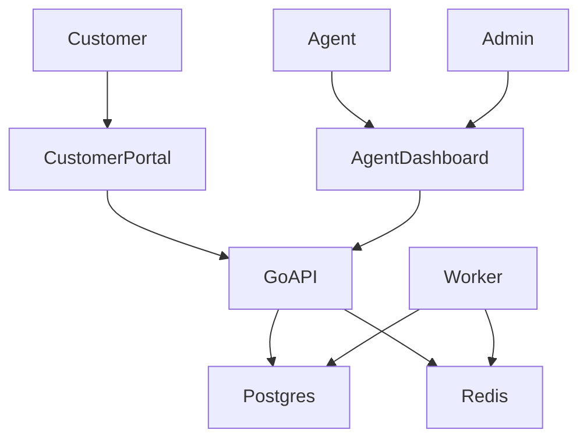

# Phase 6 — Polish & Delivery

**Goal:** Demo-ready fullstack: tests for ticket lifecycle, documentation diagrams, seed data, compose-based demo of customer + agent views.

**Depends on:** Phases 0–5  
**Exit criteria:** Checklist below matches the product brief delivery items; a new contributor can run the demo from README alone.

---

## Product checklist (from brief)

- [ ] Deployed or locally demoable customer + agent views (docker-compose acceptable)
- [ ] README with **role diagram**
- [ ] **SLA logic** documented (link to phase 3 / implementation-plan)
- [ ] **Realtime update flow** explained (sequence diagram)
- [ ] E2E or integration tests for **ticket lifecycle**

---

## Tests

### Go

- Domain: status state machine, SLA pause/resume
- Use case / HTTP integration: create → assign → comment → status → escalate; RBAC negatives; invalid transition
- Optional: publisher called only after commit (can assert with fake publisher)

### Frontend / E2E

- Playwright: customer signup → create ticket → agent login → assign → public reply visible; internal note not visible to customer
- Jest only if unit-testing non-trivial client helpers

---

## Demo seed

Script or migration seed:

- Admin, 2 agents, 1 team, 2 customers
- Sample open/pending tickets with mixed priorities and one near-breach SLA
- One canned reply, a few tags

Document credentials in README (dev only).

---

## README must include

1. Stack & DDD layout pointer to `docs/architecture.md`
2. Quick start: compose, migrate, api, worker, web
3. Role diagram (mermaid):

4. SLA rules table + pause behavior
5. Realtime: commit → publish → Redis → WS
6. Links to all `docs/phase-*.md`

---

## Bruno / API collection

- Happy-path folder spanning auth → ticket → attach → escalate → timeline
- Internal email-to-ticket example

---

## Implementation checklist

- [ ] Seed data + documented users
- [ ] Go lifecycle integration tests green
- [ ] Playwright smoke green in CI or documented local command
- [ ] README diagrams and links complete
- [ ] Cross-check every Optional brief item against phase 4
- [ ] Cross-check MVP brief items against phases 1–3 + 5
- [ ] `docs/README.md` index still accurate
- [ ] Mark phase checklists `[x]` for completed work

---

## Final verification matrix

| Brief item | Phase |
|------------|-------|
| Customer signup/login | 1, 5 |
| Agent/admin login | 1, 5 |
| Create ticket + fields | 2, 5 |
| Attachments | 3, 5 |
| Statuses + workflow | 2 |
| Assign agent/team | 2, 5 |
| Internal notes / public replies | 2, 5 |
| SLA due by priority | 3, 5 |
| Agent dashboard filters | 2, 5 |
| Customer portal | 5 |
| WebSocket realtime | 3, 5 |
| Email-to-ticket mock | 4 |
| Canned replies | 4, 5 |
| Tags + saved filters | 4, 5 |
| SLA breach worker | 4 |
| Escalation notification queue | 4 |
| Full-text search | 4, 5 |
| Audit / timeline | 4, 5 |
| Rate limit creation/replies | 4 |

---

## Out of scope still

- Production cloud deploy automation (unless added later)
- Real email provider / paid R2
